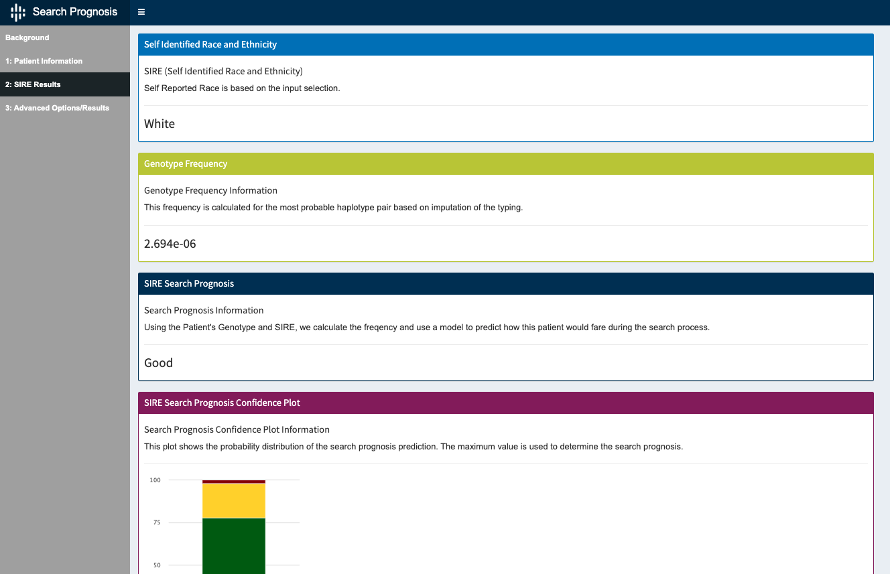
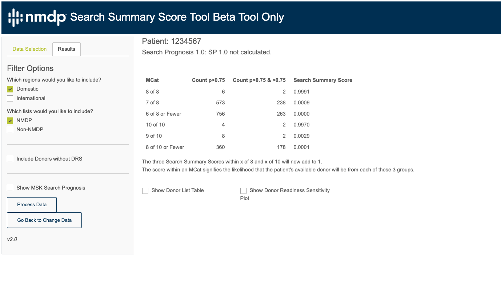
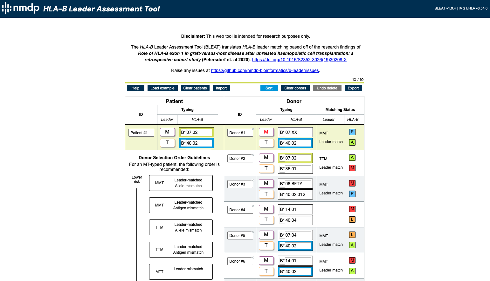
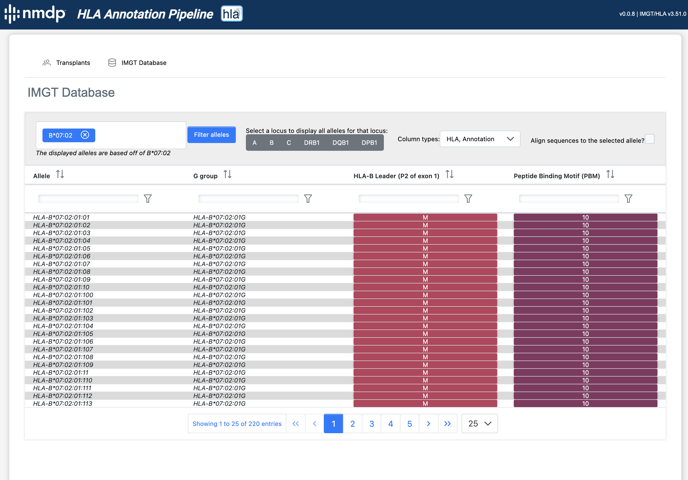

# Welcome to NMDP Bioinformatics

Below are a selection of tools developed by members of the NMDP Bioinformatics Research team.  Many of these tools are publicly available, and some accompany peer-reviewed manuscripts with citation links below.  Others are currently under development.

# Bioinformatics Research Applications and Tools

## Source Selection Tools

### 1. Search Prognosis

This application enables the ability to assess the efficiency of a search prior to beginning the search process.  It uses the patient's genotype frequency to determine a prognosis returned as Good, Fair. or Poor. 

Resources:
- [Tool](http://search-prognosis.b12x.org/)
- [Manuscript](https://pubmed.ncbi.nlm.nih.gov/27272451)

---

### 2. Haploidentical Donor Selector

This tool predicts the probability of disease-free survival from attributes of a hematopoietic stem cell transplant donor-recipient pair based on research findings (accessible via the QR code to the right).  This retrospective study of 1434 patients uses a Cox proportional hazards model to better understand the effects of HLA locus-specific risks following haploidentical transplantation using PTCy.

Resources:
- [Tool](http://haplodonorselector.b12x.org/v1.0/)
- [Manuscript](https://pubmed.ncbi.nlm.nih.gov/34724567)

---

### 3. Source Agnostic Selection Support (SASSy) Tool

Identifying the best stem cell source for hematopoietic stem cell transplantation has become increasingly complex due to newer research, increasing usage of mismatched HLA sources, disparate support tools, and a variety of transplant center methodologies. These are the issues that the Selection Agnostic Selection Support (SASSy) tool addresses to improve the source selection process.

Resources:
- **Under development**

---

### 4. Search Summary Score

Search summary score (SSS) represents the next generation of search productivity measures.  The donor score incorporates both Haplogic match predictions and Donor Readiness Score.  It can be calculated for any match category with predictions.  Validation studies so far show large increases in accuracy over existing measures.  A similar score is under development to also assess cord searches.

Resources:
- **Under development**

## HLA (Mis)matching Tools

### 5. Class I PBM Matching Tool

The Class 1 HLA Peptide Binding Motif (PBM) Matching Tool maps Class I HLA typing to PBM groups and calculates the direction of group match or mismatch.  Mismatches across PBM groups in the Graft versus Host (GvH) vector (Unidirectional GvH or Bidirectional) are predicted to be less well tolerated than mismatches within the same PBM group or in the Host versus Graft (HvG) vector (PBM matched or Unidirectional HvG).

Resources:
- [Tool](http://pbm-matching-tool.b12x.org/)
- [Manuscript](https://ascopubsl.org/doi/full/10.1200/JCO.22.01229)

---

### 6. HLA-DPB1 TCE & Expression

A tool that incorporates HLA-DP expression and HLA-DPB1 T-cell epitope (TCE) information and applies to patient and donor allotypes and matches. This tool allows for sorting of the donor list to identify favorable and permissive (mis)matches through two-step and reversible sorting of both expression and TCE models.

Resources:
- [Tool](https://dpb1-tce-expression.nmdp.org/)
- [Manuscript](https://pubmed.ncbi.nlm.nih.gov/37126658)

---

### 7. HLA-B Leader

A web application that provides services for classifying the leader peptides (either M or T at position -21) and matching statuses of HLA-B alleles and ranks them based on transplant outcome measures.

Resources:
- [Tool](https://bleader.nmdp.org)
- [Manuscript](https://www.thelancet.com/journals/lanhae/article/PIIS2352-3026(19)30208-X/fulltext)

---

### 8. HLA-DQ Heterodimers

A tool that enables the calculation of theoretical HLA-DQ heterodimers using HLA-DQA1 and HLA-DQB1 and their group classifications as G1 or G2. Can help identify patients with a high risk of relapse and also the potential for up to four HLA-DQ protein-level mismatches.

Resources:
- *Under development*
- [Manuscript](https://pubmed.ncbi.nlm.nih.gov/35271697/)

---

### 9. HLA Annotation Pipeline

With next-generation sequencing and ongoing donor recruitment, HLA diversity and complexity are ever increasing. Our pipeline handles this influx of HLA sequences and metadata by navigating IMGT reference data and annotating transplant research datasets for several HLA mismatching models (including those listed to the left).

Resources:
- [Package](https://pypi.org/project/hlann/)

---

### 10. py-ard

A web application that provides services for classifying the leader peptides (either M or T at position -21) and matching statuses of HLA-B alleles and ranks them based on transplant outcome measures.

Resources:
- [Website](https://py-ard.org)
